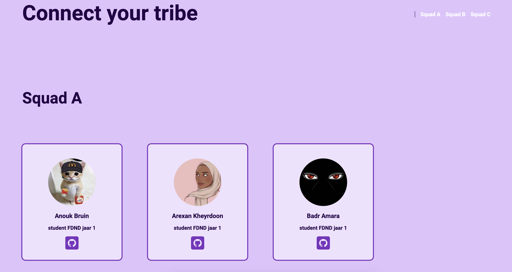

> _Fork_ deze leertaak en ga aan de slag. Onderstaande outline ga je gedurende deze taak in jouw eigen GitHub omgeving uitwerken. De instructie vind je in: [docs/INSTRUCTIONS.md](docs/INSTRUCTIONS.md)

# Connect your tribe squad page

<!-- Geef je project een titel en schrijf in één zin wat het is -->

## Inhoudsopgave

* [Beschrijving](#beschrijving)
* [Kenmerken](#kenmerken)
* [Installatie](#installatie)
* [Gebruik](#gebruik)
* [Bronnen](#bronnen)
* [Licentie](#licentie)

## Beschrijving

<!-- In de Beschrijving staat hoe je project er uit ziet, hoe het werkt en wat je er mee kan. -->
Voor deze leertaak was het de opdracht om en squad page ontwerpen en maken zodat je met elkaar in contact kan blijven.
Iedere FDND student staat in een database die te bereiken is via de API op whois.fdnd.nl.

<!-- Voeg een mooie poster visual toe 📸 -->

<!-- Voeg een link toe naar Github Pages 🌐-->
[Link naar Github page](https://github.com/joelle78/connect-your-tribe-squad-page)

## Kenmerken

<!-- Bij Kenmerken staat welke technieken zijn gebruikt en hoe. Wat is de HTML structuur? Wat zijn de belangrijkste dingen in CSS? Wat is er met Javascript gedaan en hoe? Misschien heb je een framwork of library gebruikt? -->
Voor het realiseren van de opdracht hebben we gebruik gemaakt van een bestaande API. Dit in combinatie met Node, express
en EJS.

Node is Node.js is een open-source, platformonafhankelijke JavaScript-runtime-omgeving aan de serverzijde. Hiermee
kunnen ontwikkelaars JavaScript-code schrijven die buiten een webbrowser kan worden uitgevoerd en die kan worden
gebruikt om server-side applicaties te bouwen.

Express is een populair en webframework voor Node.js dat een eenvoudige set functies biedt voor het bouwen van
webapplicaties en API's

EJS (embeddes javascript) is een eenvoudige sjabloontaal waarmee ontwikkelaars HTML-opmaak kunnen genereren met plain
JavaScript. Het wordt gebruikt met Node.js en kan worden geïntegreerd met webframeworks zoals Express om dynamische
weergaven aan de serverzijde weer te geven.

## Installatie

Om alle verschillende packages te installeren heb ik de volgende stappen gevolgt:

1. Fork de leertaak
2. Open de leertaak in je eigen editor
3. Open de terminal door de toetscombinatie ^` (control + `) te gebruiken.
4. Er opent een terminalscherm in de hoofdmap van jouw project. Voer in de terminal het commando npm install uit door
   het in te typen en op enter te drukken. Je gebruikt NPM, de Node Package Manager om een express inclusief alle
   afhankelijkheden te installeren.
5. Start het voorbeeld
   visitekaartje op door in de terminal het commando npm start uit te voeren. Als het goed is komt een melding te staan
   over het opstarten van de server: Application started on http://localhost:8000, open deze url in je browser.

## Gebruik
??

## Bronnen
- https://www.cyclic.sh/
- https://nodejs.org/en/
- https://whois.fdnd.nl/admin
- https://whois.fdnd.nl/api/v1/members?first=100
- https://ejs.co/
- https://expressjs.com/
- https://www.json.org/json-en.html

## Licentie

This work is licensed under [GNU GPLv3](./LICENSE).
